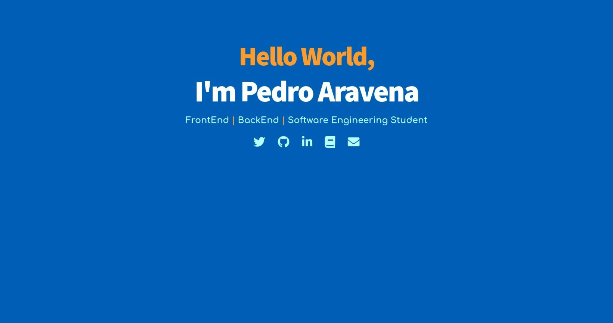

<h1>Simple Landing Page.</h1>
Create your own landing page with only 100 lines of code.

it should look like this:
 

#Visit:
https://your-landing-page.netlify.app/

<h2>Stack</h2>
<ul>
    <li>HTML</li>
    <li>CSS</li>
    <li><a href="https://fontawesome.com/">Font Awesome</a></li>
</ul>

<h2>Installation</h2>
<ol>
    <li>git clone https://github.com/opedroaravena/simple-landing-page.git</li>
    <li>Open index.html That's it!</li>
</ol>
